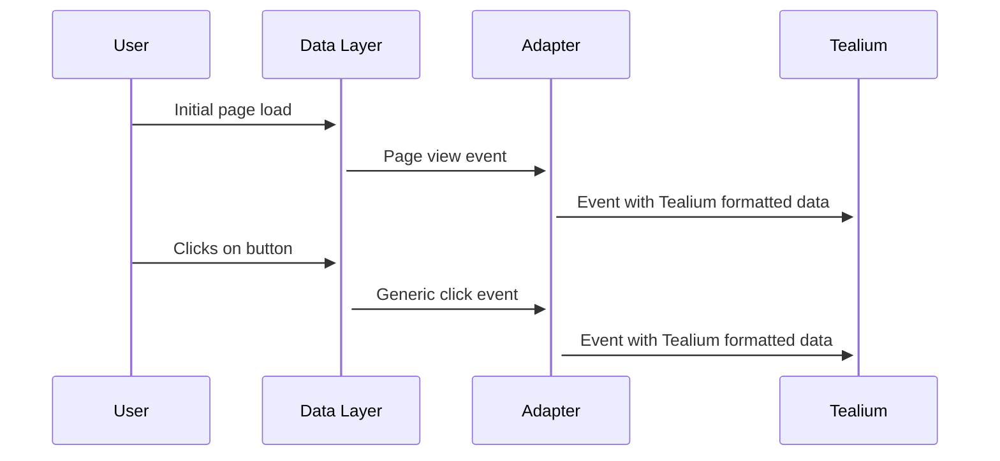

_(This may become dated, but serves as a historical reference to the decisions made during the development of the data layer)_

Let's start with a very high level overview of the interactions with the different components of the system. Here we have the 4 main components, a user interacting, the data layer, an adapter on the data layer and events going to a third party service. In this case Tealium.



## What is the data layer?
There are two main components of the data layer, one is the initial data which is contained inside it on page load. This is data that applies at a page level, for example it might contain the pages title, the locale, etc

The second component are events, these are the events that are pushed onto the data layer. These events are triggered by user interactions, this can be a user clicking on a button, scrolling past a deal, or just being on the site for a set period of time

### Structure
The internal structure of the data layer is an array of objects that represent either data on the data layer or events that have fired. The reason for keeping the objects as nested trees is to allow us to easily deal with arrays. For example if we had multiple images in a flat structure we would need to use their position in the array as part of the key, e.g. `images_0_url`.

**Example nested tree**
```js
const dataLayer = [{
    page: {
        locale: {
            market: "gb",
            url: "uk",
        },
        images: [
            {
                id: "1",
                url: "example.jpg"
            },
            {
                id: "2",
                url: "example-2.jpg"
            }
        ],
        title: "Example page"
    },
}]
```

_Note: We've opted to store `page` as a keyed object containing page level data to reduce ambiguity in the data, e.g. `page.title` is obviously the pages title where as `title` could refer to many things_

### Sending page views to third party services
By using [Google's Data
Layer Helper](https://github.com/google/data-layer-helper) to create a listener that forwards all the events that occur in the data layer onto the third party services. This allows us to create one point in the data layer code which will process events and send them to the appropriate places. This also allows us to change the events for specific services

For example with Tealium the expectation is a flat data structure with the event name set to the propery `tealium_event`, so we can simply flatten the data when we send the event this would look like (pseudo code):

```js
// Sends the page view
dataLayer.push({
  event: "page_view",
});

// Processes the page view
const tealiumListener = (dataLayer, event) => {
    // Perform tealium specific modifications to the event
    event.tealium_event = dataLayer.page_type;
    window.utag.view(event);
} 
```

This allows us to also send un-flattened page views when required too.

## Events
The standard for adding events to the data layer is to push those events onto the data layer like so:
```js
dataLayer.push({
    event: 'click',
    ...data,
})
```
This means at any point in time you can access `dataLayer` and view the initial payload _and_ all events that have fired since the page has loaded.

### Sending events to third party services
This will use the same mechanism as described in page views, an example of an event being sent:
```js
const tealiumListener = (dataLayer, event) => {
    // Perform tealium specific modifications to the event
    event.tealium_event = event.event;
    window.utag.link(event);
} 
```

## Beyond page level data
We will need to store relevant data for the different components of the website in the data layer. This will represent what those components are. We will create a **component** layer which has the information about components on the page, this will look like:
```js
const dataLayer.components = {
    'carousel-1': {
        id: 'carousel-1',
        title: 'Example',
        order: 1,
        slides: [
            'carousel-slide-1',
            'carousel-slide-2',
        ]
    },
    'carousel-slide-1': {
        image: 'example-1.jpg',
        order: 1,
        parentId: 'carousel-1',
    },
    'carousel-slide-2': {
        image: 'example-2.jpg',
        order: 2,
        parentId: 'carousel-1',
    }
}
```

To create this representation we will need to create an interface for blocks/components to populate the data and a way to link that data to those blocks/components. There will be code that is run on page load to populate the data layer with static content.

With our carousel in mind we would look at having the following:
```html
<div 
    class="carousel"
    data-layer-data='{"title":"Example", "order":1}'
    data-layer-id="carousel-1"
    data-layer-type="components/blocks/carousel"
>
    <div
        data-layer-id="carousel-slide-1"
        data-layer-type="components/blocks/carousel/slide"
        data-layer-data='{"image":"example-1.jpg"}'
        class="slide"
    >
        <button>View bookmark</button>
    </div>
    <div
        data-layer-id="carousel-slide-2"
        data-layer-type="components/blocks/carousel/slide"
        data-layer-data='{"image":"example-2.jpg","order":2}'
        class="slide"
    >
        <button>View bookmark</button>
    </div>
    <button>Previous</button>
    <button>Next</button>
    <p class="title">Example</p>
</div>
```

We know there will be dynamic elements that will be added to the page which we won't be able to predict. For example when we fetch deals on a system deal wall block. In those cases we will use mutation/intersection observers to ensure the data gets added to the component data layer. If we were to add a deal to the second slide (loaded when the user went to the slide) it would look like this:
```html
<div
    data-layer-data='{"image":"example-2.jpg"}'
    data-layer-type="components/blocks/carousel/slide"
    class="slide"
>
    <div
        class="deal"
        data-layer-id="deal-1"
        data-layer-type="components/systemdeals/deal"
        data-layer-data='{"title": "Example deal"}'
    >
        Example deal
    </div>
    <button>View bookmark</button>
</div>
```

We would then have a mutation/intersection observer which would add the data to the data layer and attach a parent ID dynamically:
```js
const elementAdded = (element) => {
    if (!element.hasAttribute('data-layer-data')) {
        return;
    }
    
    // Get the data from the element
    const jsonData = element.getAttribute('data-layer-data')
    const data = JSON.parse(jsonData);

    // Get the parent and create the relation if possible
    const parentData = element
        .closest('data-layer-data')
        ?.getAttribute('data-layer-data')
    if (parentData) data.parentId = parentData.id; 
    
    // Add the data to the data layer
    dataLayer.components[data.id] = data;
} 
```
_Note: we add the parent ID at this point in time to prevent needing to scan the dom when an event fires_

## Generic events
We aim to have a generic set up without hard coded event listeners per interactive element. To achieve this we need to create a specification for what a trackable element looks like, how it associates to an event type, and the information it sends

### Clickable event
We will continue to use the carousel from above as our example. To associate the Next button with an event listener we would update it to have a click listener, for example this might look like:
```html
<button
    data-layer-clickable
    data-layer-data='{"title": "Next"}'
    data-layer-type="components/carousel/next"
>
    Next
</button>
```
This would give us enough information to fire an event that looks like:
```js
dataLayer.push({
    event: 'click',
    data_component_type: 'components/carousel/next',
    event_data: [
        {
            "key": "title",
            "value": "Next",
        }
    ]
})
```
_Note: We know that Tealium might expect a specific event for this, so we could look at adjusting the tealium adapter to use `type` as the event name in place of `event`_

### Parent context
We might need information that's specific to the carousel (perhaps it's title), to allow for this when an event is fired it will contain the id of the element and/or the closest parent id in the tree. In this specific case we would get:

```js
dataLayer.push({
    event: 'click',
    data_component_type: 'components/carousel/next',
    event_data: [
        {
            "key": "title",
            "value": "Next",
        },
        {
            "key": "parentId",
            "value": "carousel-1",
        },
    ]
})
```

This would allow any third party tool to listen for events and use the key/value pairs to discover additional data. For example if we wanted to get the carousel title from the above event we could run the function:
```js
const parentComponent = dataLayer.get(`components.${event.parentId}`)
const title = parentComponent.title;
```

If the there is an id, for example if our button looked like:
```html

<button
    data-layer-clickable
    data-layer-data='{"title": "Next"}'
    data-layer-id="carousel-1-next"
    data-layer-type="components/carousel/next"
>
    Next
</button>
```

Then we will fire an event with the id included too, like so:
```js
dataLayer.push({
    event: 'click',
    data_component_type: 'components/carousel/next',
    event_data: [
        {
            "key": "id",
            "value": "carousel-1-next",
        },
        {
            "key": "parentId",
            "value": "carousel-1",
        },
    ]
})
```

### Bundling context in the event
The largest concern at this point is the fact that we don't have all the context in the one event, this means we need third party services to be able to query our data layer when events fire (which they might not be able to). Therefore, we will create functionality in the adapters to recursively get the data. This would mean that if we were to reply our example above we would get an event sent to a third party service that looks like:
```js
const event = {
    event: 'click',
    data_component_type: 'components/carousel/next',
    event_data_id: "carousel-1-next",
    event_data_parent_id: "carousel-1",
    event_data_parent_title: "Example",
}
```

**Constraints:** By doing this we will end up in a state where we couldn't wrap a carousel within a carousel without losing part of the context. This is likely not to be an issue with our current components/blocks. If however it does become one we are confident we can find a solution which is compatible with the current design

## Adapters
Adapters get events relayed through them, if an event enters our data layer we relay that event through the adapter. The largest challenge here is to only start relaying events when all adapters have loaded and are ready. Therefore, we'll need some form of callback from the adapters to register that they have loaded. Once we've gotten the callback from all expected adapters we will start to send the events through them, first by replaying the existing ones, secondly by sending the new ones onwards.

### Connecting
We'll rely on adapters calling `TNZ.Tracking.adaptorLoaded(id)` where `id` is the trackers registered ID. We've been able to confirm this works with Tealium but we'll need to update the code that is there to include an interval timer to run the call back (this covers the scenatio where the Tealium library loads before the tracking library but not before it loads `flattenObject` code)

### Modifiers
Modifiers are functions that take in events and modify the data in them (this can also be adding additional data). An example of a known modifier is that Tealium needs the event name stored in the variable `tealium_event`. The modifier can be described as:
```ts
type ModifierFunction = {
    (event: object): object
}
````
With the `tealium_event` looking like:
```ts
const addTealiumEvent: ModifierFunction = (event: object) => {
    return {...event, tealium_event: event.event ?? 'generic_event'};
}
```

These modifiers will be adapter specific. Tealium requires flattening for which we'll use the [code](https://community.tealiumiq.com/t5/Customer-Data-Hub/Tealium-Collect-and-Google-Tag-Manager-GTM-Setup-Guide/ta-p/17939) they've recommended using when converting a nested event/data layer to a flat one.

## Testing
The aim here is to ensure we create a path forwards for end-to-end testing that will allow us to test data layer events in the future. Due to the fact that we've got our generic data layer (along with the [helper](https://github.com/google/data-layer-helper)) this will be easy as we can access the data layer directly from within our tooling, e.g.
```js
assert.equal(window.dataLayerHelper.get('page.title'), 'Example tile')
assert.equal(window.dataLayerHelper[4].title, 'Example tile')
```

### Testing adapters
We'll need to investigate how to test adapters in end to end tests, this might be through registering a test adapter that just pipes events through or relying on overriding window.teal to listen to events

## Backend generation of data layer
This is to cover the generation of the data within `data-layer-data` attributes. The goal here is to create easily maintainable and extendable code/functionality.

### Blocks
We're opting to create a tracking namespace which contains both the logic around creating tracking attributes, but also the data (e.g. component type identifiers). We'll create abstract classes/traits which allow us to implement attribute data creation easily. For example, we could have the following for a bookmark:

```php
class Bookmark extends HTMLDecorator
{
    use Clickable;

    private static $type = 'components/generic/bookmark';
    
    protected function getInstanceData(): ?array
    {
        $instance = $this->getInstance();
        
        if (!$instance || !$instance->BookmarkTitle) {
            return null;
        }
        
        return [
            'title' => $instance->BookmarkTitle,
        ];
    }
}
```

We would then access it through a template variable (using `DL` as a shorthand for data layer) like so:
```php
<button class="next" $DL('Bookmark', $Block)>Next</button>
```

What's hidden here, is code that generates the attributes which are then added to the DOM. This is implemented in the abstract classes

#### Specification of the event contexts
To allow for documentation of the event types, we'll create a spec for each item in YML which would look like so:

```yml
components/generic/bookmark:
  properties:
      - 
       property: title
       type: string
       required: true
      -
        property: referral
        type: bool
        required: false
```

#### Lower level context
Interactions within blocks will need to be identified, they will however not contain parental data in favour of when the event fires, scanning upwards to find their parent. These interactions will still require data added to them, for example a carousel next button needs to be easily identified from a call to action in the carousel. For this we will look to either create generic template functions or reuse the `$DL` function

_An example of this would be:_
```php
<button class="next" $DL('components/carousel/next')>Next</button>
```

### Pages
For page level data we'll replicate the block method and instead of exposing it as an attribute, we'll expose it as variables with the data layer on page load. This will allow for a generic level of data from all pages, with the ability to add additional data where needed (e.g. business listings).

### Generic elements
We'll need to add data to elements such as the header/footer. This is currently an unknown (likely a mix of generic template/model functions).

### Separation of concerns
To ensure the code created for tracking doesn't impact negatively on the maintainability and readability of the current codebase we will create this functionality in its own namespace and rely on unit tests to inform us when changes to model's(pages/blocks/data) could impact the data layer. 
